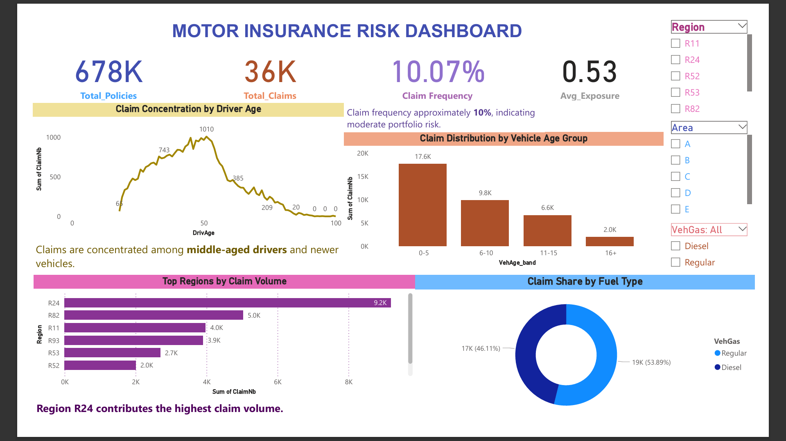

# Motor Insurance Risk Dashboard

## Project Overview
This project analyzes motor insurance claim data using Excel, SQL, and Power BI to identify claim trends, portfolio risk concentration, and business insights.

## Tools Used
- Excel
- SQL
- Power BI

## Key Features
- Claim Frequency Analysis
- Driver Age Risk Analysis
- Vehicle Age Group Analysis
- Regional Claim Distribution
- Fuel Type Claim Comparison
- Interactive KPI Dashboard

## Key Insights
- 678K+ policy records analyzed
- Claim frequency around 10%
- Claims concentrated among middle-aged drivers
- Region R24 recorded highest claims

## Files Included
- Power BI Dashboard (.pbix)
- SQL Queries
- Excel datasets
- Dashboard screenshots

## Dashboard Preview

